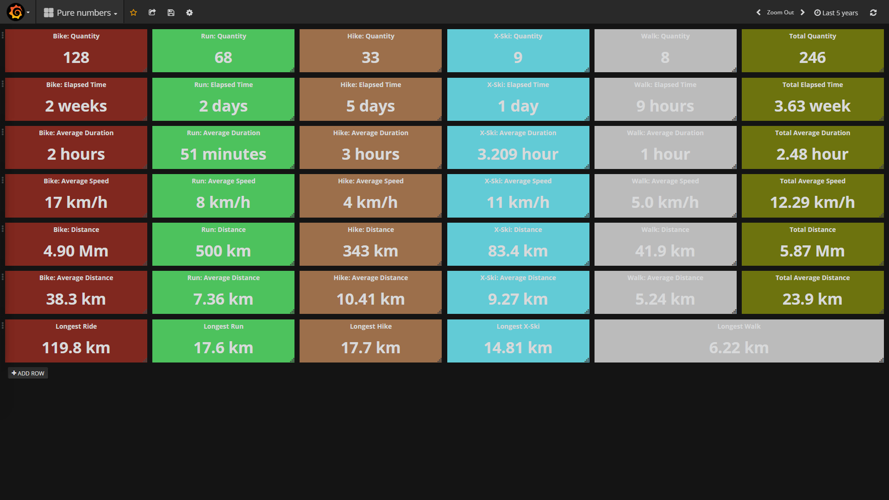
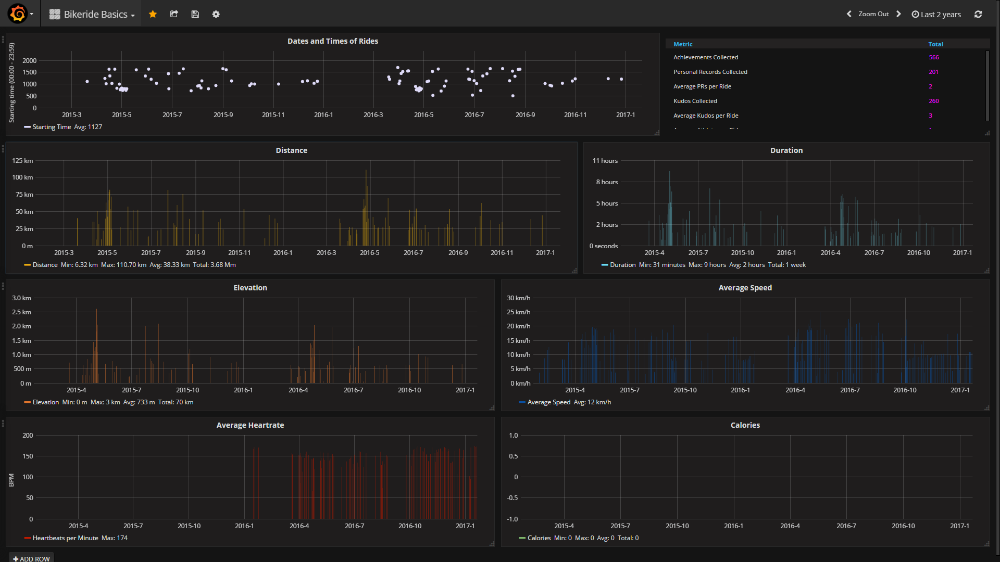

Grava - Analyse your Strava activities in Grafana
=============================

Grava uses the [Strava API](https://strava.github.io/api/) to collect your personal activities. The activities are written inside a database and can be analysed afterwards.
The used database [InfluxDB](https://www.influxdata.com/) is a time series database. [Grafana](http://grafana.org/) is used for visualizing and analysing the metrics of the activities. The helper code is written in Python.

**Grava is not designed to run on public servers or should be accessable from the internet. It should run in your protected network. It handles data. Be careful. Keep your secrets to yourself and don't share data or at least careful.**

|
<a href=./dashboards/pure_numbers_db.png></a>
<a href=./dashboards/ride_basics_db.png></a>
|

## Status
**Version 0.1**

Grava is in a developing/testing state. There are several issues and missing features. You are welcome to test it.
For testing place a *limit* to the query and use a test database.

## Featureset
* *token_helper.py*: helps to get your Strava authentication tokens
* *grava_init_backend.py*: Reads your Strava activities, normalise the data and writes it into a InfluxDB database
* *grava_init_frontend.py*: Creates Grafana datasources and reads JSON templates to create Grafana dashboards 

## How to see your Data with Grava
**1. Clone this repository (Linux)**
  ```
  git clone https://github.com/rotti/grava.git
  cd grava
  ```

**2. InfluxDB: Linux Installation (Ubuntu)**

  ```
  sudo apt-get update
  curl -sL https://repos.influxdata.com/influxdb.key |  sudo apt-key add - source /etc/lsb-release echo "deb https://repos.influxdata.com/${DISTRIB_ID,,} ${DISTRIB_CODENAME} stable" | sudo tee /etc/apt/sources.list.d/influxdb.lis
  sudo apt-get update && sudo apt-get install influxdb
  ```
  Find further help here: https://docs.influxdata.com/influxdb/v1.1/introduction/installation/

**3. Grafana: Linux Installation (Ubuntu)**
  ```
  echo "deb https://packagecloud.io/grafana/stable/debian/ wheezy main" | sudo tee /etc/apt/sources.list.d/grafana.list 
  curl https://packagecloud.io/gpg.key | sudo apt-key add -
  sudo apt-get update && sudo apt-get install grafana
  ```
  Find further help here: http://docs.grafana.org/installation/debian/

  If you want to use another visualising tool than Grafana, skip this step.

**4. Python Library: Linux Installation**

  TODO

  ```
  pip install influxdb, xxxxxxxxxx

  ```

**5. Start the Backend Services (Ubuntu)**
  ```
  sudo service influxdb start
  sudo service grafana-server start
  ```

**6. Fill Database with Strava Activities**
  ```
  python grava_init_backend.py
  ```
  You will need your *Strava Access Token* to get your Strava activities. Use *token_helper.py" the get it.

**7. Generate Grafana Datasources and Dashboards (optional)**
  ```
  python grava_init_frontend.py
  ```

  Using the Dashboard Templates is optional. You may make your own. Find further help here: http://docs.grafana.org/


**7. Login to Grafana**

  Open a browser and connect to Grafana. If it runs on your system the URL would be *http://localhost:3000*

  Login with the credentials ...

  > User: admin
  > Passwort: admin

  Do the Grafana configuration. Find further help here: https://docs.grafana.org/datasources/influxdb/

  TODO: explain how to configure Grafana datasources


## Usage of token_helper.py
Token helper gets your Strava *access token* and writes it to a file inside your authfile directory ("*./authfiles/access_token"*). It also provides help to get your code needed for the token exchange.

### Steps
**1.** Register as a developer at [strava.com](http://strava.com) and create your project to get your *ClientID* and your *Client Secret*.
**2.** Write your *ClientID* inside the file
> ./authfiles/client_id

**3.** Write your *Client Secret* inside the file 
> ./authfiles/client_id

**4.** Write your *exchange token* inside the file 
> ./authfiles/auth_code

**5.** Execute *token_helper.py* with 
  ```
  python token_helper.py
  ```

To get your *exchange token* open a browser and use the following URL. Don't forget to put your *ClientID* inside the URL:
> https://www.strava.com/oauth/authorize?client_id=YOURCLIENTID&response_type=code&redirect_uri=http://localhost/token_exchange&scope=write&state=mystate&approval_prompt=force

Login with your Strava credentials and authorise your application. Afterwards you will receive and "Unable to connect" failure from your browser. Ignore it. You will receive your *exchange token*. It will loke something like 
> http://localhost/token_exchange?state=mystate&code=**1d1de858d2005b56e02d16d657cfad8bbc769a6f**

Paste the "code" to your file. It is your *exchange token* needed for **step 4**.

*token_helper.py* can provide some help to get your *exchange token*. Uncomment the specified section inside the code and execute it afterwards. Don't forget to put the comments in again afterwards. It will open a browser for you and will put in the needed URL.

Find further help here: https://strava.github.io/api/v3/oauth/


## Missing Functionalities
There are always missing features. Here is a small list of things Grava is missing.
* Write better code. The never ending story, after all :)
* Deliver useful (more) dashboards for analysing.
* Write a script and try to install Grava without having the user to do stuff.


## Inspiration and additional useful URLs

https://groups.google.com/forum/m/#!forum/strava-api

http://www.andremiller.net/content/grafana-and-influxdb-quickstart-on-ubuntu

https://github.com/weaveworks/grafanalib

https://github.com/hozn/stravalib

https://github.com/influxdata/influxdb-python

http://influxdb-python.readthedocs.io/en/latest/examples.html

https://docs.influxdata.com/influxdb/v0.8/api/query_language/

http://play.grafana.org/

https://grafana.net/


